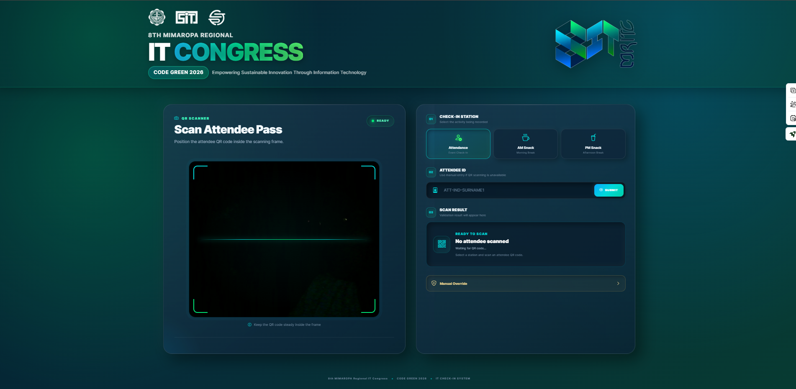
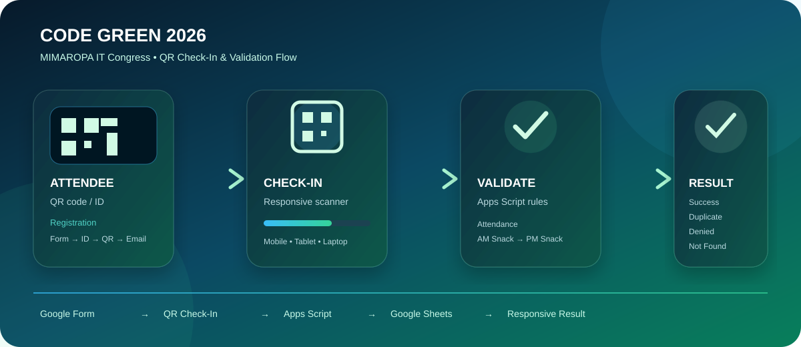

<div align="center">


<br>

<h3>QR-Based Attendee Check-In & Validation System</h3>

<p>
  <strong>Built exclusively for the 8th MIMAROPA Regional IT Congress</strong>
</p>

<p>
  <code>HTML5</code>
  <code>CSS3</code>
  <code>JavaScript</code>
  <code>Google Apps Script</code>
  <code>Google Sheets</code>
  <code>GitHub Pages</code>
</p>

</div>

---

## Live System Preview

The interface is designed for the actual event check-in workflow and adapts across mobile, tablet, and desktop screens.

### Mobile UI

<div align="center">

</div>

### Desktop UI

<div align="center">

</div>

> These SVG previews illustrate the responsive interface and visual design of the system. The deployed GitHub Pages application remains the live operational interface.

---

## System Workflow

<div align="center">

</div>

The system connects attendee registration, QR scanning, Apps Script validation, Google Sheets recording, and responsive result feedback into one event check-in workflow.

---

## Purpose

This system is a dedicated event check-in and validation interface for the **8th MIMAROPA Regional IT Congress — CODE GREEN 2026**.

Its sole purpose is to support the **attendance and event-validation operations of the MIMAROPA IT Congress**, including Attendance, AM Snack, and PM Snack checkpoints.

---

## Check-In Flow

### Attendance

```text
QR Scan
   ↓
Find Attendee
   ↓
Check Attendance
   ↓
SUCCESS / ALREADY SCANNED
```

### AM Snack

```text
QR Scan
   ↓
Verify Attendance
   ↓
Check AM Snack
   ↓
SUCCESS / ALREADY SCANNED / DENIED
```

### PM Snack

```text
QR Scan
   ↓
Verify Attendance
   ↓
Verify AM Snack
   ↓
Check PM Snack
   ↓
SUCCESS / ALREADY SCANNED / DENIED
```

---

## Validation Rules

| Station | Requirement | Duplicate Protection |
|---|---|---|
| Attendance | Attendee must exist | Yes |
| AM Snack | Attendance must be recorded | Yes |
| PM Snack | Attendance + AM Snack must be recorded | Yes |

The backend performs the authoritative validation before any station record is written.

---

## Result Feedback

The operator receives an immediate result after a scan.

| Result | Meaning |
|---|---|
| **SCAN SUCCESSFULLY** | The selected station was successfully recorded. |
| **ALREADY SCANNED** | The selected station was already recorded for the attendee. |
| **TRY AGAIN** | A prerequisite or validation condition was not satisfied. |
| **ATTENDEE NOT FOUND** | The attendee ID does not exist. |
| **CONNECTION ERROR** | The frontend could not obtain a valid backend response. |

The result interface can display:

- Attendee name
- Attendee ID
- Timestamp
- Validation message
- Current station
- Continue-scanning action

---

## Responsive UI

The system is intended for:

```text
Mobile
   ↓
Tablet
   ↓
Laptop / Desktop
```

The UI uses the CODE GREEN visual language:

- Deep navy
- Blue
- Cyan
- Emerald green
- Blue-to-green gradients
- Glassmorphism surfaces
- Neumorphism-inspired controls
- Soft shadows
- Rounded cards
- Responsive spacing
- Clear status states

---

## Registration & QR Workflow

```text
Google Form
     ↓
Form Submission Trigger
     ↓
Generate Attendee ID
     ↓
Generate QR Code
     ↓
Generate Registration Email
     ↓
Attendee Receives QR
     ↓
QR Used at Event Check-In
```

---

## Frontend Architecture

```text
CODE-GREEN-2026/
│
├── index.html
├── style.css
├── script.js
├── code-green-header.svg
├── system-workflow.svg
├── mobile-preview.svg
├── desktop-preview.svg
└── README.md
```

### `index.html`

Contains the page structure and interface components.

### `style.css`

Controls the responsive layout, visual theme, glassmorphism/neumorphism styling, result modal, and animations.

### `script.js`

Handles QR scanning, station selection, backend requests, validation-result handling, popup behavior, sound feedback, and UI animations.

---

## Backend Architecture

```text
Frontend
   │
   │ attendee ID + selected station
   ▼
Google Apps Script
   │
   ├── Find attendee
   ├── Validate station
   ├── Check prerequisites
   ├── Check duplicate
   └── Record timestamp
   │
   ▼
Google Sheets
   │
   ▼
JSON response
   │
   ▼
Responsive result popup
```

---

## Technology Stack

| Layer | Technology |
|---|---|
| Interface | HTML5 |
| Styling | CSS3 |
| Client Logic | JavaScript |
| QR Scanning | `html5-qrcode` |
| Hosting | GitHub Pages |
| Backend | Google Apps Script |
| Records | Google Sheets |
| Registration | Google Forms |
| Email | Apps Script Mail Service |

---

## GitHub Pages Deployment

The frontend is suitable for deployment through GitHub Pages:

```text
GitHub Repository
       ↓
GitHub Pages
       ↓
HTTPS Web Interface
       ↓
Event Check-In Devices
```

The frontend communicates with the deployed Google Apps Script Web App for validation and record processing.

---

## Security

For production/event deployment:

- Do not publish authorization PINs.
- Do not commit API keys or credentials.
- Restrict Google Sheet access to authorized personnel.
- Keep sensitive configuration outside public frontend code.
- Use HTTPS for the public check-in interface.
- Limit access to attendee records appropriately.

---

## Event-Day Checklist

```text
[ ] Google Form verified
[ ] Google Sheet verified
[ ] Apps Script trigger verified
[ ] QR generation verified
[ ] Registration email verified
[ ] Camera permission verified
[ ] Attendance tested
[ ] AM Snack tested
[ ] PM Snack tested
[ ] Duplicate scan tested
[ ] Invalid attendee tested
[ ] Manual override tested
[ ] Mobile UI tested
[ ] Tablet UI tested
[ ] Laptop UI tested
[ ] Timestamp verified
[ ] GitHub Pages verified
[ ] Apps Script Web App verified
```

---

<div align="center">

<h3>CODE GREEN 2026</h3>

<p><strong>8th MIMAROPA Regional IT Congress</strong></p>

<p>QR-Based Attendee Check-In & Validation System</p>

<sub>Built exclusively for the attendance and event-validation operations of the MIMAROPA IT Congress.-MeowMeow</sub>

</div>
